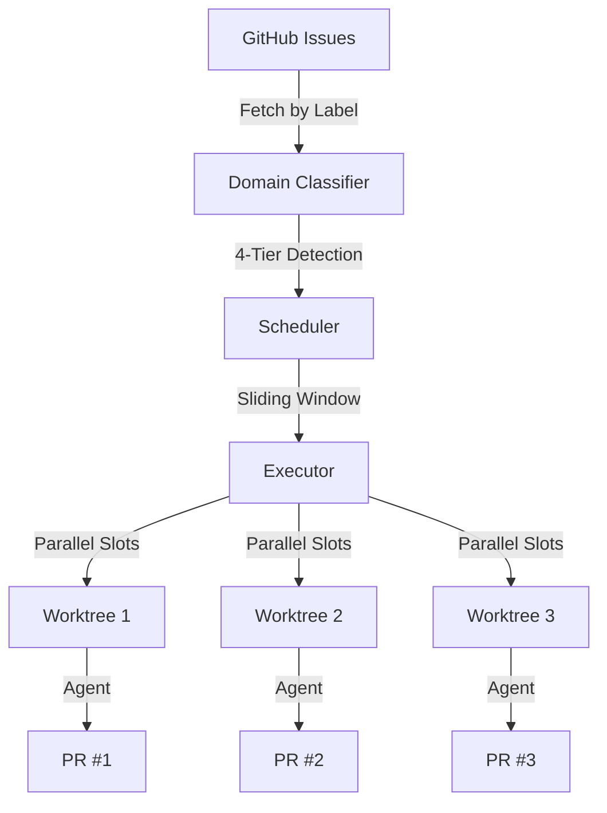
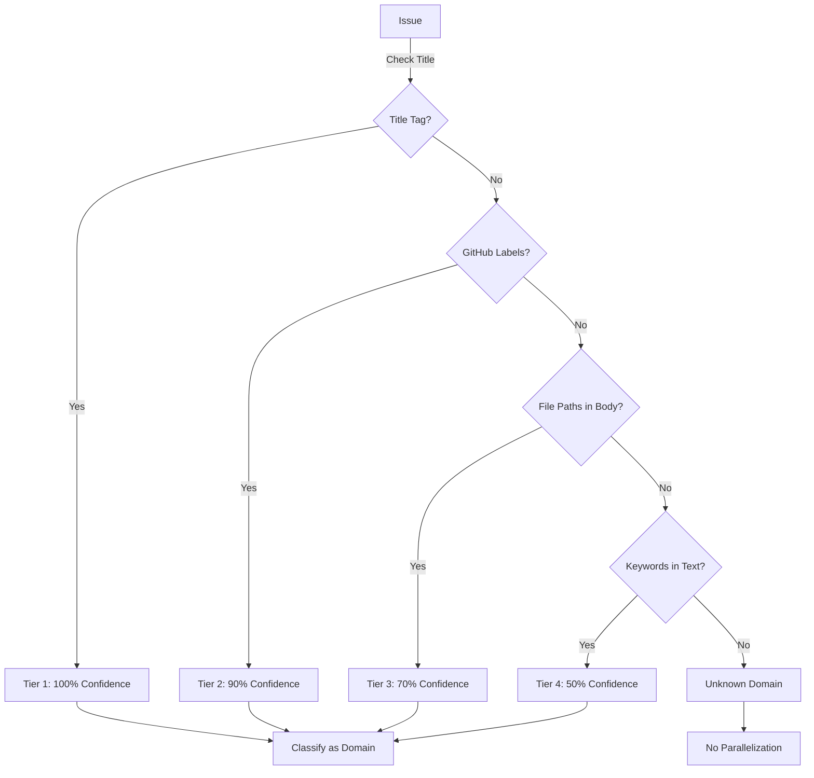
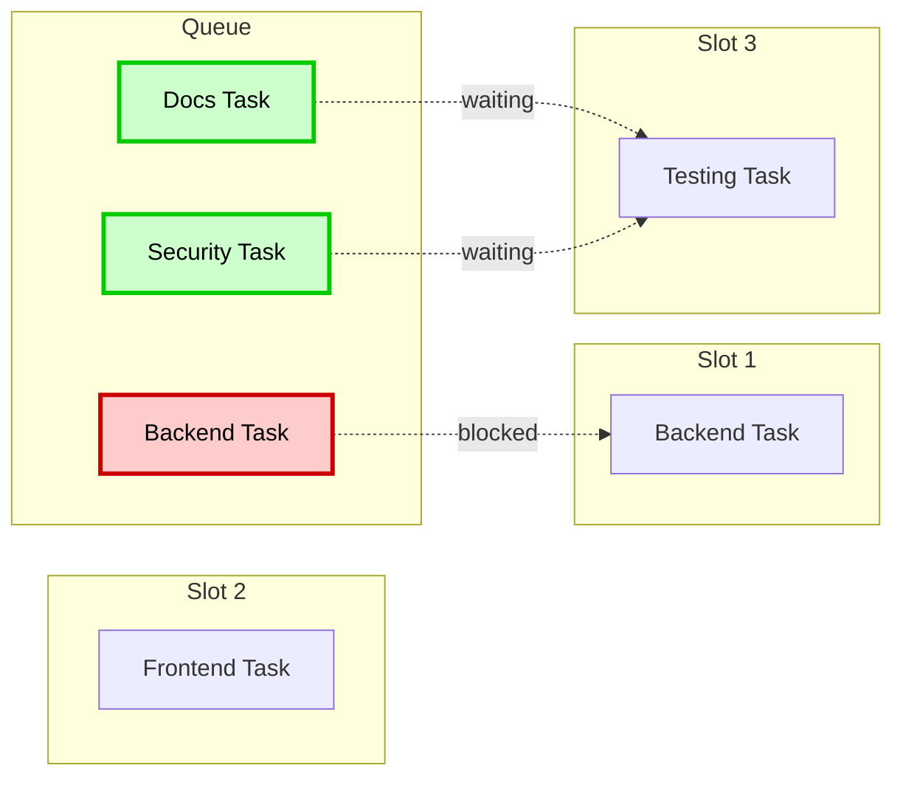
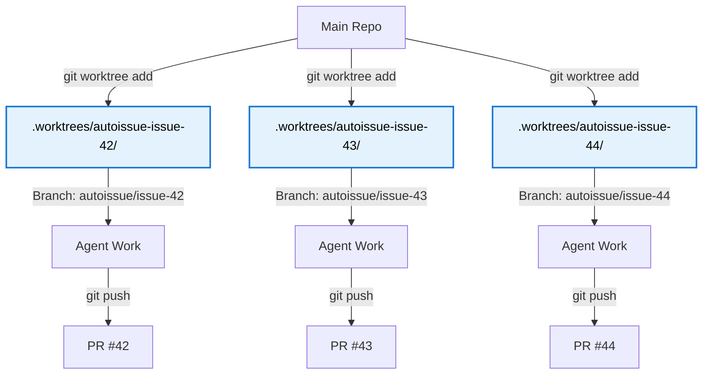

# Autoissue 2.0

[](https://www.npmjs.com/package/@venin/autoissue)
[](LICENSE)
[](https://www.typescriptlang.org/)

> **Turn your GitHub backlog into pull requests, overnight.**

Autoissue is a parallel AI code execution engine that transforms GitHub issues into production-ready pull requests. It intelligently classifies tasks by domain, schedules them for parallel execution, and runs each in an isolated git worktree to prevent conflicts.

## Features

- **Parallel Execution** - Run up to 10 tasks concurrently with configurable slots
- **Domain-Aware Scheduling** - Backend + Frontend run together, Backend + Backend don't
- **Isolated Worktrees** - Each task gets its own directory and branch (no conflicts)
- **Automatic PRs** - Creates pull requests with issue references and descriptions
- **4-Tier Classification** - Title tags, labels, file paths, and keyword matching
- **Error Recovery** - Circuit breakers, retry logic, automatic cleanup
- **Cost Tracking** - Real-time budget monitoring across all tasks
- **Session Persistence** - Resume failed runs from where they stopped
- **Zero Configuration** - Auto-detects your repository and uses sensible defaults

## Quick Start

### Installation

```bash
npm install -g @venin/autoissue
```

Or run directly with `npx`:

```bash
npx @venin/autoissue --issues autoissue-1
```

### Basic Usage

Label your GitHub issues with `autoissue-1`, then run:

```bash
autoissue --issues autoissue-1
```

Autoissue will:
1. Fetch all open issues labeled `autoissue-1`
2. Classify each by domain (backend, frontend, database, etc.)
3. Schedule compatible tasks in parallel (3 concurrent by default)
4. Execute each in an isolated git worktree
5. Create pull requests for completed tasks

### Example Workflow

1. **Create Issues**
   ```bash
   gh issue create --title "[Backend] JWT authentication" \
                    --body "Implement JWT auth with refresh tokens" \
                    --label "autoissue-1,backend"

   gh issue create --title "[Frontend] Login form" \
                    --body "Create login UI component" \
                    --label "autoissue-1,frontend"
   ```

2. **Run Autoissue**
   ```bash
   autoissue --issues autoissue-1
   ```

3. **Review PRs**
   ```bash
   gh pr list
   ```

## Architecture

### System Overview



Autoissue follows a simple pipeline:

1. **Issue Fetching** - Uses `gh` CLI to fetch open issues by label
2. **Domain Classification** - Analyzes title, labels, file paths, and keywords
3. **Scheduling** - Fills parallel slots with compatible tasks
4. **Execution** - Spawns Claude Code agents in isolated worktrees
5. **PR Creation** - Creates pull requests with automatic issue linking

### Domain Classification

Autoissue uses a **4-tier decision tree** to classify tasks:



**Tier 1 (100% Confidence): Title Tags**
- `[Backend]`, `[Frontend]`, `[Database]`, `[Infra]`, etc.
- Explicit domain declaration in issue title

**Tier 2 (90% Confidence): GitHub Labels**
- Labels like `backend`, `frontend`, `testing`, etc.
- Reliable signal from issue creator

**Tier 3 (70% Confidence): File Path Patterns**
- `src/api/`, `src/components/`, `drizzle/`, etc.
- Inferred from file paths mentioned in issue body

**Tier 4 (50% Confidence): Keyword Matching**
- Keywords like "trpc", "router", "component", "useEffect", etc.
- Fallback method with lower confidence

### Sliding Window Scheduler

Autoissue uses a **sliding window algorithm** to maximize parallelization while preventing conflicts:



**Compatibility Rules:**
- Same domain tasks **cannot** run in parallel (file conflicts)
- Database tasks **block everything** (schema affects all domains)
- Cross-domain tasks **can** run in parallel (backend + frontend = OK)
- Unknown domain tasks **run sequentially** (safety first)

**Scheduling Algorithm:**
1. Fill empty slots with compatible tasks from the queue
2. When a task completes, free its slot
3. Immediately schedule the next compatible task
4. Repeat until queue is empty

### Worktree Isolation

Each task runs in an **isolated git worktree** to prevent merge conflicts:



**How It Works:**
1. Create a new branch for the task (e.g., `autoissue/issue-42`)
2. Create a worktree in `.worktrees/autoissue-issue-42/`
3. Spawn Claude Code agent with `cwd` set to the worktree path
4. Agent reads/writes files in isolation
5. Push branch and create PR
6. Clean up worktree when done

**Benefits:**
- No merge conflicts between parallel tasks
- Each agent has full repository context
- Main working directory stays clean
- Safe to run multiple agents simultaneously

## Usage

### Direct Mode (Process Issues by Label)

```bash
autoissue --issues autoissue-1
```

Fetches all open issues labeled `autoissue-1`, classifies their domains, and processes them in parallel.

**Options:**
- `--config <path>` - Custom config file (default: `autoissue.config.json`)
- `--verbose` - Enable debug logging
- `--dry-run` - Simulate execution without running agents
- `--yolo` - Skip permission prompts (auto-approve agent actions)

### Planner Mode (Directive to Issues)

```bash
autoissue --directive "Build JWT authentication with refresh tokens"
```

Uses AI to break the directive into GitHub issues with automatic dependency tracking, then processes them in the correct order.

**Features:**
- AI decomposes complex directives into discrete tasks
- Automatically creates GitHub issues with proper labels
- Builds dependency graph to prevent execution deadlocks
- Visualizes dependencies as ASCII art and Mermaid diagrams
- Executes tasks in topological order (dependencies first)

**Dependency Graph Output:**
```
📊 Dependency Graph:
────────────────────────────────────────────────────────────
  #42 ← depends on [41] → blocks [43]
  #41 → blocks [42, 43]
  #43 ← depends on [41, 42]
────────────────────────────────────────────────────────────
📊 Dependency graph saved: ~/.autoissue/dep-graph-abc123.html
```

Open the HTML file in a browser to view the interactive Mermaid diagram.

### Headless Mode

```bash
autoissue --issues autoissue-1 --headless
```

Runs without interactive UI, suitable for CI/CD pipelines.

### Resume Failed Sessions

```bash
autoissue --resume
```

Resumes the most recent session from where it failed.

## Configuration

### Auto-Detection

Autoissue auto-detects your repository settings:
- Repository: From `git remote get-url origin`
- Path: Current working directory
- Base branch: `main` (or `develop` if detected)

### Manual Configuration

Create `autoissue.config.json`:

```json
{
  "project": {
    "repo": "owner/repo",
    "path": "/path/to/repo",
    "baseBranch": "main"
  },
  "executor": {
    "maxParallel": 3,
    "timeoutMinutes": 30,
    "createPr": true,
    "prDraft": false
  },
  "agent": {
    "model": "sonnet",
    "maxBudgetUsd": 5.0,
    "yolo": true,
    "maxTurns": 8
  },
  "maxTotalBudgetUsd": 50.0
}
```

### Configuration Reference

#### `project`
- **repo** (required): GitHub repository in `owner/repo` format
- **path** (required): Absolute path to repository root
- **baseBranch** (default: `"main"`): Branch to create task branches from

#### `executor`
- **maxParallel** (default: `3`, range: `1-10`): Number of concurrent task slots
- **timeoutMinutes** (default: `30`, range: `5-120`): Maximum time per task
- **createPr** (default: `true`): Whether to create PRs automatically
- **prDraft** (default: `false`): Create PRs as drafts

#### `agent`
- **model** (default: `"sonnet"`): Claude model (`opus`, `sonnet`, `haiku`)
- **maxBudgetUsd** (default: `5.0`, min: `0.01`): Maximum spend per task
- **yolo** (default: `true`): Skip permission prompts
- **maxTurns** (optional): Maximum agent turns (model-specific defaults)

#### `maxTotalBudgetUsd`
- (default: `50.0`, min: `0.01`): Total budget across all tasks

### Advanced Configuration

#### Telegram Integration

```json
{
  "telegram": {
    "enabled": true,
    "token": "YOUR_BOT_TOKEN",
    "allowedUserIds": [12345678, 87654321],
    "health": {
      "enabled": true,
      "port": 3000,
      "bindAddress": "0.0.0.0"
    }
  }
}
```

#### Dashboard Server

Enable the real-time web dashboard to monitor execution progress:

```json
{
  "dashboard": {
    "enabled": true,
    "port": 3030
  }
}
```

Or via CLI:

```bash
autoissue --issues autoissue-1 --dashboard
```

The dashboard provides:
- Real-time task status updates (running, completed, failed)
- Live cost tracking
- Task metadata (domain, PR number, duration)
- WebSocket-based updates (no polling)

Access at `http://localhost:3030` while Autoissue is running. The server automatically shuts down 5 seconds after execution completes.

## Domain Classification

### Supported Domains

| Domain | Title Tags | Labels | File Paths | Keywords |
|--------|-----------|--------|------------|----------|
| **backend** | `[Backend]`, `[API]`, `[Server]` | `backend`, `api`, `server` | `src/api/`, `src/routers/`, `src/lib/trpc/` | `trpc`, `router`, `endpoint`, `mutation`, `webhook`, `auth`, `jwt`, `oauth` |
| **frontend** | `[Frontend]`, `[UI]`, `[Client]` | `frontend`, `ui`, `component` | `src/components/`, `src/pages/`, `src/app/` | `component`, `useState`, `useEffect`, `jsx`, `tsx`, `button`, `modal`, `form` |
| **database** | `[Database]`, `[DB]`, `[Schema]` | `database`, `db`, `migration` | `src/db/`, `drizzle/`, `.schema.ts` | `drizzle`, `migration`, `schema.change`, `add.column`, `create.table` |
| **infrastructure** | `[Infra]`, `[CI]`, `[Deploy]` | `infra`, `ci`, `devops` | `.github/`, `docker/`, `Dockerfile` | `docker`, `github.action`, `deploy`, `caddy`, `nginx`, `aws`, `pipeline` |
| **security** | `[Security]`, `[Vuln]`, `[CVE]` | `security`, `vulnerability` | N/A | `vulnerabilit`, `xss`, `csrf`, `sql.injection`, `owasp`, `secret.leak` |
| **testing** | `[Test]`, `[Testing]`, `[QA]` | `testing`, `e2e`, `qa` | `tests/`, `__tests__/`, `*.test.ts` | `playwright`, `jest`, `vitest`, `e2e.test`, `unit.test` |
| **documentation** | `[Docs]`, `[Documentation]` | `docs`, `documentation` | N/A | `readme`, `changelog`, `contributing`, `swagger`, `jsdoc` |

### Compatibility Matrix

|  | Backend | Frontend | Database | Infra | Security | Testing | Docs | Unknown |
|---|---------|----------|----------|-------|----------|---------|------|---------|
| **Backend** | ❌ | ✅ | ❌ | ✅ | ✅ | ✅ | ✅ | ❌ |
| **Frontend** | ✅ | ❌ | ❌ | ✅ | ✅ | ✅ | ✅ | ❌ |
| **Database** | ❌ | ❌ | ❌ | ❌ | ❌ | ❌ | ❌ | ❌ |
| **Infra** | ✅ | ✅ | ❌ | ❌ | ✅ | ✅ | ✅ | ❌ |
| **Security** | ✅ | ✅ | ❌ | ✅ | ❌ | ✅ | ✅ | ❌ |
| **Testing** | ✅ | ✅ | ❌ | ✅ | ✅ | ❌ | ✅ | ❌ |
| **Docs** | ✅ | ✅ | ❌ | ✅ | ✅ | ✅ | ❌ | ❌ |
| **Unknown** | ❌ | ❌ | ❌ | ❌ | ❌ | ❌ | ❌ | ❌ |

- ✅ = Can run in parallel
- ❌ = Must run sequentially

### Best Practices

1. **Use Title Tags** - Always prefix issue titles with domain tags for 100% accuracy:
   ```
   [Backend] Implement JWT authentication
   [Frontend] Create login form component
   [Database] Add users table
   ```

2. **Add Domain Labels** - Use GitHub labels as a fallback:
   ```bash
   gh issue create --title "JWT auth" --label "backend,autoissue-1"
   ```

3. **Include File Paths** - Mention specific files in issue descriptions:
   ```markdown
   Modify `src/api/auth.ts` to add JWT middleware
   ```

4. **Avoid "Unknown"** - Tasks classified as "unknown" run sequentially (slow)

## Troubleshooting

### Common Issues

#### "No issues found"
**Cause:** No open issues with the specified label.
**Fix:** Check that your issues are labeled correctly:
```bash
gh issue list --label "autoissue-1"
```

#### "Worktree already exists"
**Cause:** Previous run didn't clean up worktrees.
**Fix:** Manually prune worktrees:
```bash
git worktree prune
rm -rf .worktrees/
```

#### "Budget exceeded"
**Cause:** Task exceeded `maxBudgetUsd` or `maxTotalBudgetUsd`.
**Fix:** Increase budget in config:
```json
{
  "agent": { "maxBudgetUsd": 10.0 },
  "maxTotalBudgetUsd": 100.0
}
```

#### "Task timeout"
**Cause:** Task exceeded `timeoutMinutes`.
**Fix:** Increase timeout in config:
```json
{
  "executor": { "timeoutMinutes": 60 }
}
```

#### "PR creation failed"
**Cause:** Missing GitHub CLI or authentication.
**Fix:** Install and authenticate:
```bash
gh auth login
```

#### "Domain conflict"
**Cause:** Two tasks from the same domain trying to run in parallel.
**Fix:** This is expected behavior. The scheduler will run them sequentially.

### Debug Mode

Enable verbose logging to diagnose issues:

```bash
autoissue --issues autoissue-1 --verbose
```

Logs are written to `~/.autoissue/logs/autoissue-<timestamp>.log`.

### Session Recovery

If a run crashes, resume from the last checkpoint:

```bash
autoissue --resume
```

Session state is saved to `~/.autoissue/sessions/<session-id>/state.json`.

## Development

### Setup

```bash
# Clone the repository
git clone https://github.com/Venin-Client-Systems/autoissue.git
cd autoissue

# Install dependencies
npm install

# Build
npm run build

# Link globally
npm link
```

### Development Workflow

```bash
# Type check
npm run typecheck

# Run tests
npm test

# Watch mode
npm run test:watch

# Dev mode (no build step)
npm run dev -- --issues test
```

### Project Structure

```
autoissue/
├── core/
│   ├── executor.ts         # Main execution loop
│   ├── scheduler.ts        # Sliding window scheduler
│   ├── worktree.ts         # Git worktree management
│   ├── agent.ts            # Claude Code agent wrapper
│   └── session.ts          # Session persistence
├── lib/
│   ├── types.ts            # Zod schemas and types
│   ├── config.ts           # Configuration loader
│   ├── domain-classifier.ts # 4-tier classification
│   ├── github-client.ts    # GitHub API client
│   ├── logger.ts           # Structured logging
│   └── paths.ts            # File path utilities
├── __tests__/              # Test suites
├── examples/               # Example configurations
├── index.ts                # CLI entry point
├── cli.ts                  # Commander CLI
└── package.json
```

### Testing

Autoissue uses Vitest for testing:

```bash
# Run all tests
npm test

# Run specific test file
npm test -- core/scheduler.test.ts

# UI mode
npm run test:ui
```

### Contributing

See [CONTRIBUTING.md](CONTRIBUTING.md) for guidelines.

## Comparison with Other Tools

| Feature | Autoissue | Ralphy | Sweep | AutoPR |
|---------|-----------|--------|-------|---------|
| **Parallel Execution** | ✅ (3-10 tasks) | ✅ (Unlimited) | ❌ | ❌ |
| **Domain-Aware Scheduling** | ✅ | ❌ | ❌ | ❌ |
| **Isolated Worktrees** | ✅ | ✅ | ❌ | ❌ |
| **4-Tier Classification** | ✅ | ❌ | ❌ | ❌ |
| **Session Persistence** | ✅ | ❌ | ❌ | ❌ |
| **Cost Tracking** | ✅ | ✅ | ❌ | ❌ |
| **Auto PR Creation** | ✅ | ✅ | ✅ | ✅ |
| **AI Model** | Claude Sonnet 4.5 | Claude Sonnet 4.5 | GPT-4 | GPT-4 |
| **Self-Hosted** | ✅ | ✅ | ❌ | ❌ |

**When to use Autoissue:**
- You have a backlog of well-defined GitHub issues
- You want parallel execution with conflict prevention
- You need cost control and budget tracking
- You want full control over the execution environment

**When to use Ralphy:**
- You need unlimited parallelization (no slot limit)
- You're okay with manual conflict resolution
- You prefer a bash-first approach

## FAQ

### How does Autoissue prevent merge conflicts?

Each task runs in an isolated git worktree with its own branch. Tasks are scheduled to avoid domain conflicts (e.g., two backend tasks won't run simultaneously). This guarantees no merge conflicts during execution.

### What happens if an agent makes a mistake?

The agent's work is isolated in a branch. You can review the PR before merging. If the PR is incorrect, close it and the changes won't affect your main branch.

### Can I run Autoissue in CI/CD?

Yes! Use headless mode:
```bash
autoissue --issues autoissue-1 --headless --yolo
```

### How much does it cost?

Costs depend on the Claude model and task complexity:
- **Haiku**: ~$0.10-0.50 per task
- **Sonnet**: ~$0.50-2.00 per task
- **Opus**: ~$2.00-10.00 per task

Set budget limits in `autoissue.config.json` to control costs.

### Can I customize the agent's behavior?

Not yet. Future versions will support custom system prompts and agent configuration.

### Does it work with private repositories?

Yes! Autoissue uses `gh` CLI, which respects your GitHub authentication.

### What languages/frameworks are supported?

Autoissue is language-agnostic. It works with any codebase that uses Git and GitHub.

## Roadmap

- [ ] **Planner Mode** - Directive → Issues (AI-powered issue generation)
- [ ] **Custom Prompts** - User-defined system prompts per domain
- [ ] **Web UI Dashboard** - Real-time progress monitoring
- [ ] **Telegram Bot** - Remote control and notifications
- [ ] **Multi-Repo Support** - Process issues across multiple repositories
- [ ] **PR Review Integration** - Automatic code review comments
- [ ] **Metrics & Analytics** - Success rate, cost per domain, etc.
- [ ] **GitHub Actions Integration** - Trigger on issue label events

## License

MIT - see [LICENSE](LICENSE)

## Acknowledgments

Built by [Venin Client Systems](https://github.com/Venin-Client-Systems) with:
- [Claude Code](https://claude.ai/claude-code) - AI-powered code execution
- [Commander.js](https://github.com/tj/commander.js) - CLI framework
- [Zod](https://github.com/colinhacks/zod) - TypeScript-first validation
- [Vitest](https://vitest.dev/) - Testing framework

## Support

- **GitHub Issues**: [Report bugs or request features](https://github.com/Venin-Client-Systems/autoissue/issues)
- **Discussions**: [Ask questions](https://github.com/Venin-Client-Systems/autoissue/discussions)
- **Email**: support@venin.space

---

**Made with Claude Code** - Autoissue is built using the same AI technology it automates.
